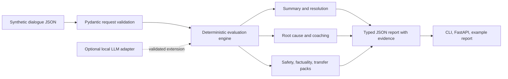

# Architecture

The default path is intentionally local and deterministic. It accepts a small JSON dialogue, validates it with Pydantic, runs eight task packs against transparent generic terms, and serializes a typed report. It has no remote model, private policy corpus, or external score service.

## Boundaries

- `schemas.py` is the request and response contract. Unknown input and report fields are rejected.
- `engine.py` contains the deterministic, public-safe task-pack logic and emits `insufficient_evidence` rather than guessing.
- `cli.py` loads a fixture or caller-supplied local JSON and writes the same structured report as the API.
- `api.py` is a minimal FastAPI wrapper with `/healthz` and `/v1/evaluate`.
- `LocalLLMAdapter` is a protocol only. An implementation must be local, independently evaluated, schema-validated, and able to cite the supplied evidence before being exposed.

The Docker image runs only the API. It does not add authentication, data retention, queueing, or a production policy engine.
